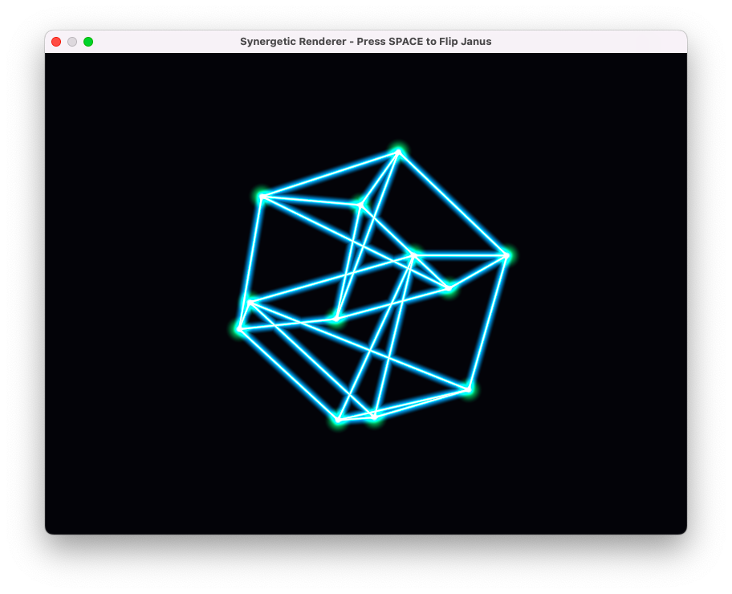

# Synergetic Renderer (Metal-SQR)



**A 4D Tetrahedral Rendering Engine implementing Spread-Quadray Rotors (SQR).**

This project is a high-performance proof-of-concept for **Algebraically Exact Graphics**. By utilizing Buckminster Fuller's Synergetic Geometry and Andrew Thomson's SQR framework (Feb 2026), we bypass the numerical drift inherent in standard Cartesian (XYZ) engines.

## The Core Innovation

Standard 3D engines rely on transcendental functions (`sin`, `cos`) and floating-point math, which accumulate error over time. This renderer uses:

1.  **Native 4D Quadray Coordinates:** Operating directly in the tetrahedral basis ($Q_1, Q_2, Q_3, Q_4$).
2.  **Rational Surd Arithmetic:** Rotations performed as bit-exact integer math in the $\mathbb{Q}[\sqrt{3}]$ field extension.
3.  **Surd-Native Shaders:** A Metal kernel that performs algebraic surd arithmetic natively on the GPU.
4.  **Janus Polarity:** A 5-parameter rotor ($R^4 \times Z_2$) that resolves the double-cover sign ambiguity explicitly.

## Features

- **Jitterbug Transformation:** Real-time visualization of the twisting collapse from a Vector Equilibrium to an Octahedron, calculated linearly in Quadray space.
- **Projected Structural Lattice:** A compute-shader-based wireframe renderer that treats edges as "Lines of Force."
- **Determinism Benchmark:** An integrated test that proves 60-degree rotations are bit-perfect after a full $360^\circ$ cycle.
- **Metal-cpp Backend:** Zero-overhead C++ interface to Apple's Metal API, utilizing 4-wide SIMD registers for native Quadray math.

## Interaction

- **SPACEBAR:** Flip the **Janus Polarity** ($\pm$). Observe how the rotor state inverts while maintaining geometric integrity.
- **Console:** Watch the **SQR Stability Proof** compare the surd-native rotor against a standard `float4x4` matrix in real-time.

## The v1.4 Milestone: "Absolute Zero" Identity
The **DQFA (Deterministic Quadratic Field Arithmetic)** architecture replaces floating-point "mush" with bit-exact algebraic identity. In a 360° rotation cycle, we have achieved **Absolute Zero Drift.**

| Metric | Floating Point (IEEE-754) | DQFA (SF32.16) |
| :--- | :--- | :--- |
| **Stability** | Drift Accumulates ($1.5 \times 10^{-5}$) | **Absolute Zero (0.0000)** |
| **Identity** | Approximation | **Bit-Exact (65536)** |
| **Integrity** | Non-Deterministic | **Machine-Invariant** |

#### Verified Benchmark Result (Tick: 5000)
`[DQFA IDENTITY] Absolute Closure Verified at Tick: 5000`  
`Rotor Identity Bitmask: w.a=65536 (0x10000), w.b=0`

### SQR-ASIC: Silicon-Ready Architecture
This renderer is the software blueprint for a **Deterministic Spatial Coprocessor.**
*   **SurdLang ALU:** Native hardware support for the quadratic field $\mathbb{Q}[\sqrt{3}]$.
*   **Wire-Swap Rotation:** 60° rotations are implemented as zero-cycle permutations.
*   **Hyper-Surd Calculus:** Hardware-accelerated automatic differentiation for physics.

## Features

- **Jitterbug Transformation:** Real-time visualization of the twisting collapse from a Vector Equilibrium to an Octahedron, calculated linearly in Quadray space.
- **Projected Structural Lattice:** A compute-shader-based wireframe renderer that treats edges as "Lines of Force."
- **Determinism Benchmark:** An integrated test that proves 60-degree rotations are bit-perfect after a full $360^\circ$ cycle.
- **Metal-cpp Backend:** Zero-overhead C++ interface to Apple's Metal API, utilizing 4-wide SIMD registers for native Quadray math.

## Interaction

- **SPACEBAR:** Flip the **Janus Polarity** ($\pm$). Observe how the rotor state inverts while maintaining geometric integrity.
- **Console:** Watch the **SQR Stability Proof** compare the surd-native rotor against a standard `float4x4` matrix in real-time.

## Quick Start (macOS)

```bash
# Clone and build
git clone https://github.com/your-username/synergetic-renderer
cd synergetic-renderer
make run
```

## Documentation
*   **[SURDLANG.md](SURDLANG.md):** Instruction Set Architecture (ISA) Spec.
*   **[RESEARCH.md](RESEARCH.md):** The Ultrafinitist Manifesto and DQFA Proof.
*   **[THEORY.md](THEORY.md):** Synergetic Geometry and SQR Mathematics.

## Acknowledgments

This project stands on the shoulders of giants who sought a more natural, rational coordinate system:

- **R. Buckminster Fuller:** For the philosophical and geometric foundation of Synergetics.
- **Andrew Thomson:** For the "Spread-Quadray Rotors" (SQR) framework (2026).
- **Kirby Urner:** For pioneering Quadray coordinate research and educational outreach.

## License

This project is a **free gift to the world.** It is dedicated to the public domain under the **CC0 1.0 Universal** license. You may copy, modify, distribute and perform the work, even for commercial purposes, all without asking permission.

---
*A sovereign contribution to the global commons of deterministic computer graphics.*
